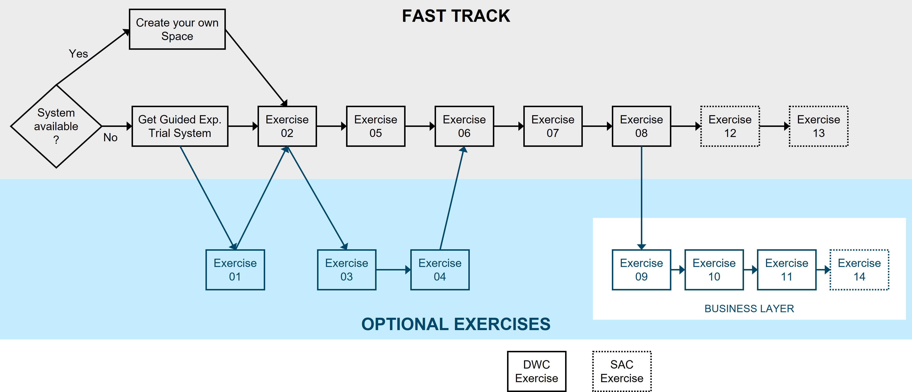

# Exercise Overview

We structured the overvall exercise in a way, that we created a 
  * **Fast Track** for anyone eager to finish early and enjoy exploring the system on your own.
  * **Optional Exercises** if you want to learn more about the solution especially how to create tables, ER Models, and Business Layer Models.

 
    
### Let's give you a brief introduction on what can you expect in the different parts of the exercise.
  

## 1. **Getting Started**
   
   In this area you get an [overview about the business scenario & the data model](exercises/ex00/README.md) used throughout the exercises.
   
   We also give you guidance how to [get your guided experience trial system](exercises/ex00/README_GuidedTrial.md) in case you do not have access to a SAP Data Warehouse Cloud system already.
	
## 2. **SAP Data Warehouse Cloud**
   
   In this section you get an overview about your [first log on](exercises/ex01/README.md) and how you navigate in the system in case you have never used SAP Data Warehouse Cloud before. 
   
   The first **mandatory** exercise in [#02: Get to know your own Space](exercises/ex02/README.md) where you learn more about Spaces and create the ***Time Dimension*** required for your modeling in later parts of the exercise.
	  
## 3. **SAP Data Warehouse Cloud – Data Builder**

   This is the core part of the modeling exercise. You can [manually create the tables](exercises/ex03/README.md) and the [entity relationship model](exercises/ex04/README.md), or use the ***Fast Track*** by [importing the tables](exercises/ex05/README.md) provided with the [CSN file](https://cap.cloud.sap/docs/cds/csn) called *Sales_ER_Model.json*.
   
   Then you populate the tables with data by [uploading data files](exercises/ex06/README.md) using the CSV files from the ZIP file. Based on this tables you then [create a dimension view](exercises/ex07/README.md) as well as an [analytical dataset](exercises/ex08/README.md).
	
## 4. **SAP Data Warehouse Cloud – Business Layer**

   The exercises in the Business Layer are ***optional***. However, if you are interested you will learn how to create a [dimension](exercises/ex09/README.md), an [analytical dataset](exercises/ex10/README.md), and a [consumption model](exercises/ex11/README.md).
	
## 5. **SAP Analytics Cloud**

   In this part you will create simple stories in SAP Analytics Cloud to learn how to visualize your data based on a live connection to SAP Data Warehouse Cloud. The first story shows a [year over year comparison](exercises/ex12/README.md) and the second the [revenue by geography](exercises/ex13/README.md). Both require the previous exercises to be completed up to exercise 08. 
   
   The final story about the [best salesperson](exercises/ex14/README.md) can only be completed if you finished the exercise 09 to 11.

## Summary

Now that you have a good understanding of the exercises, you can start into the hands-on part.

Continue with [Exercise 01: First Log On](../ex01/README.md)
