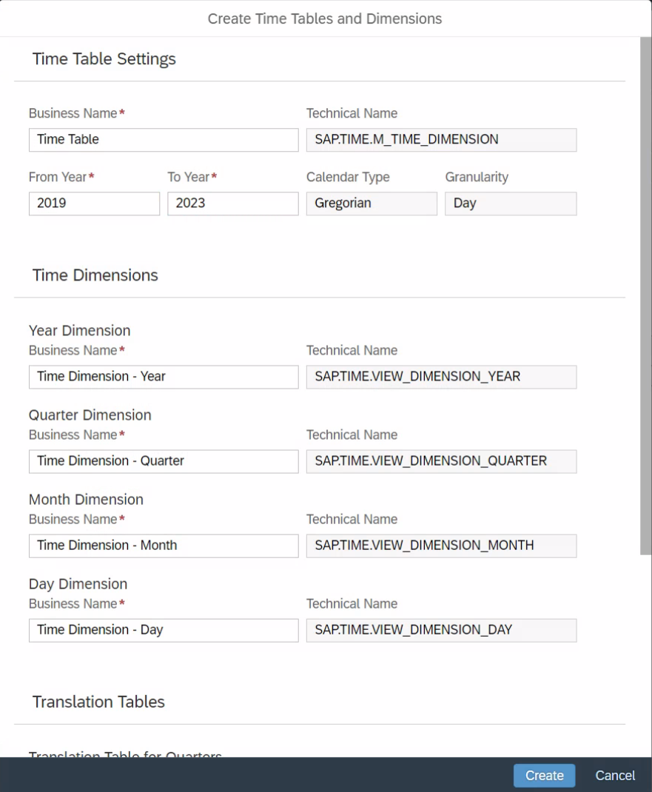

# Exercise 2 - Exercise 02: Get to know your own Space

:memo: **Note:** This is an OPTIONAL Exercise

In this optional exercise, we will show you your own Space. 
Spaces as part of the SAP Data Warehouse Cloud solution are virtual team environments where your administrator has the ability to assign users and roles, as well as additional resources, such as connections to data sources, and allocated storage.  In SAP Data Warehouse Cloud all data related workflows start with the selection of a Space, so you can see the Space is a fundamental concept.

:point_right: In case you do not use a guided experience trial system for this hands-on training, then you require a space on the SAP Data Warehouse Cloud tenant you are using. 

1. In the menu on the left-hand side, select the option Space Management.
 

2. After you selected the menu item, you will be presented with a list of existing Spaces .
 

4. Click the ***EDIT*** button on your assigned space. 
The pre-defined spaces are usually named the same way as your user ID for example GE12345. The technical ID is identical to the space name. 

 

5. You are now being presented with the properties of your Space and you have the ability to configure certain options.  Changing the storage assignment or workload managment options is not possible in guided experience trial systems. 

6. In the members section you can see that your user (e.g. GE12345) is already assigned to the Space.
 

7. In the **Time Data** section click on ***+ Create time Tables and Dimensions*** to create the time dimension in your space.
 

8. For the From Year enter 2019.
9. For the To Year enter 2023.
10. For all other elements leave the default values.
11. Click Create.
 
 This will create a set of Date / Time Tables which we will use as part of our model to create a date hierarchy
(Year, Quarter, Month, Day).

12. The changes in the **Time Data** section will be deployed immediately. There is no need to save or deploy this change in your space. 
 

## Summary

You just created your first Space in SAP Data Warehouse Cloud and you can now start your next step and
create your first Table and Model.

Continue to - [Exercise 03: Prepare Your Data (optional) ](../ex03/README.md)
