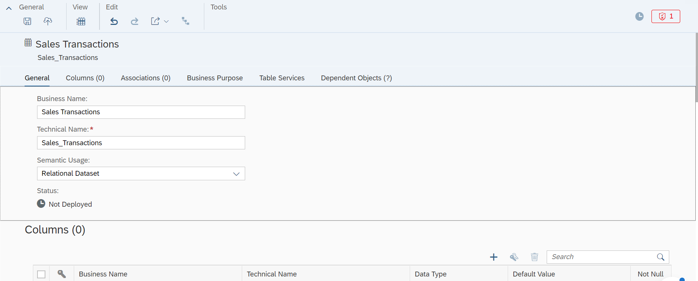

# Exercise 3 - Data Layer - Prepare Your Data

Before we are going to start with our first exercise in creating a table and creating our first model, lets clarify the
different asset types that you can create in SAP Data Warehouse Cloud.
When you launch the Data Builder from the menu, you will be presented with this screen:
 

So, let’s now look at the different asset types:
-Table: Here you basically define a new table from scratch, and you configure each field of the table and
you do have the ability then to upload data to this table later on.

-Graphical View: In the Graphical View you can leverage Tables and Views to the create new Views
using a visual interface.

-SQL View: In the SQL View you can leverage Tables and Views to the create new Views by using SQL
directly.

-Entity Relationship Model: Here you define the relationships between Tables or Views, which then are
being leveraged when you create a new View based on the Tables or Views.

-Data Flow: Here you can define data transformations and leverage the option to load data from a source
system into SAP Data Warehouse Cloud.

In this section we will start creating the tables for our sample models and then upload the raw data to those
tables. In the first part of this overall section, we will look at the sample model and which tables we will need. In
the second part we will then create those tables in SAP Data Warehouse Cloud and finally in the third part, we
will upload the raw data to those newly created tables, and we will also setup a hierarchy as part of the tables.

In the next steps we will setup a relatively simple data model and we will start by creating the tables first and
then upload the information for each table in form of CSV Files

In the next steps we will start to create the tables in SAP Data Warehouse Cloud.

1. Log On to your SAP Data Warehouse Cloud tenant.

2. Select the menu option Data Builder on the left-hand side.

3. In case you are being asked, select your previously created Space – ANA161_XX.

 
4. Select the option New Table

 
5. You are being presented with the details to create a new table.
6. Enter the following details:
- Business Name - Sales Transactions

- Technical Name - Sales_Transactions

- Type - Relational Dataset

7. We also can provide already as part of the table, some business description and Tags, which then will be
used as part of the Business Catalogue.
8. Enter the following details for the Business Purpose:
|<ul><li>Description - This is the table for the Sales Transactions</li><li>Tags - Sales transaction, Revenue, transactions</li><li>|

## Summary

You've now ...

Continue to - [Exercise 3 - Excercise 3 ](../ex3/README.md)
