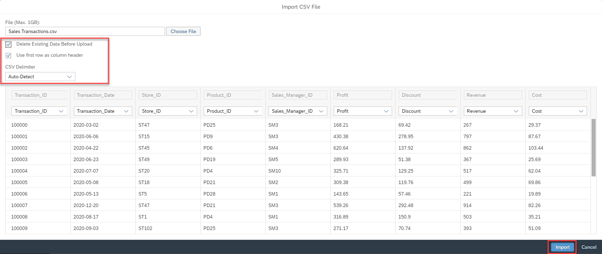
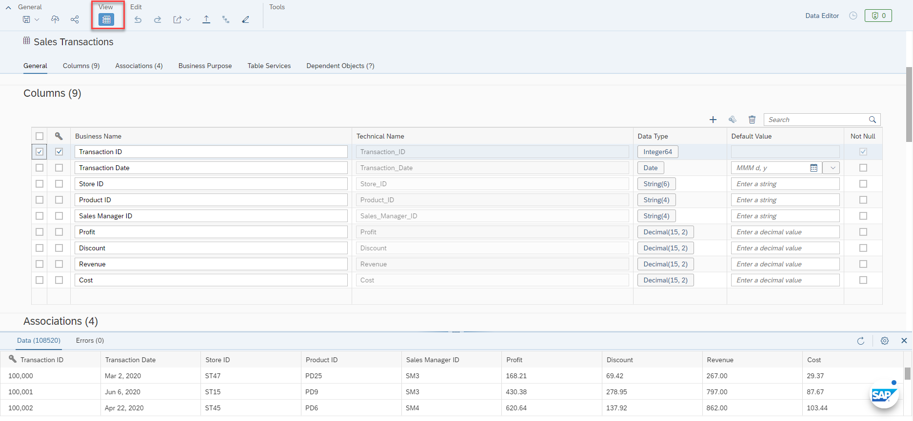

# Exercise 06 - Uploading Data

>:memo: **Note:** This is a <strong>MANDATORY</strong>  Exercise

---

In this exercise, we will populate the tables we have created in the previous steps, so that we have data for the analysis.

The files for this exercise are part of the ZIP file you downloaded in the beginning.
We will now upload the CSV files into the corresponding tables.
1. Log On to your SAP Data Warehouse Cloud tenant.
2. Select the menu option Data Builder on the left-hand side.
3. Use a double-click on the table Sales Transactions.
4. Select the menu option Upload Data from CSV File in the toolbar.
  

5. Click Choose ***File***.  
6. Navigate to where you unzipped the download.
7. Select the file ***“Sales Transactions.csv”***.
  

8. Ensure the option ***Delete Existing Data Before Upload*** is enabled.
9. Ensure the option ***Use first row as column header*** is enabled.
10. Ensure the ***CSV Delimiter*** option is set to ***Auto-Detect***.
11. Ensure that all columns of the table have a mapped column from the CSV File.
12. Click ***Import***.
  

13. You should receive a message about the successful import of the information.
14. You can use the ***Data Preview*** to check if the data was loaded into the table.
 

15. There is no need to save / deploy the table after you imported the data.

> :boom: ***Important*** :boom:   You can now continue and repeat the steps 4 - 14 for the other tables. Each table does have a corresponding CSV file as part of the download. Please upload the data for the following tables: - Product (Dimension Product.csv) - Store (Dimension Store.csv)  - Sales Manager (Dimension Sales Manager.csv) 

## Summary

Now you have imported all the data files and you can start to build the data model. 

Continue to - [Exercise 07: Creating the Dimension (mandatory)](../ex07/README.md)
