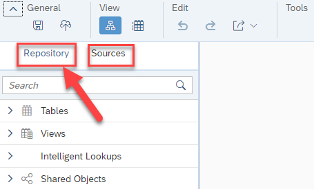
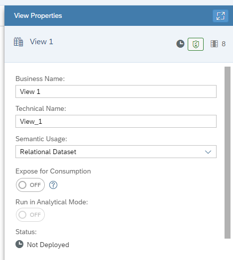
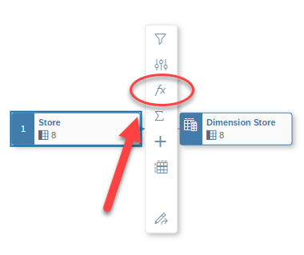
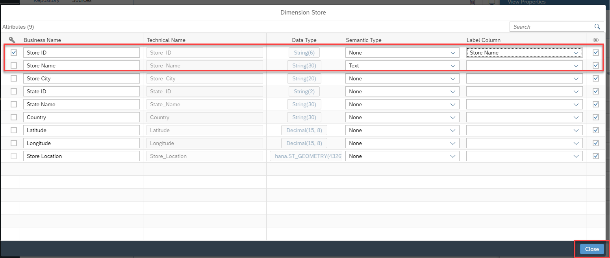

# Exercise 7 - Creating the Dimension 

:memo: **Note:** This is a <strong>MANDATORY</strong>  Exercise

In this exercise, we will create our first dimension. Part of the steps of defining the dimension will also be to configure the
geographic enrichment, so that we can leverage the Store Location later in SAP Analytics Cloud.

In the next steps we will create the new Dimension View based on our previously created tables
1. Log On to your SAP Data Warehouse Cloud tenant.
2. Select the menu option Data Builder on the left-hand side.

3. Click New Graphical View.
  

4. On the left-hand side you can decide between: <ul><li>Repository: Here you have access to the local tables (imported data) and Views.</li><li>Sources: Here you have access to your connections and the remote tables.
 

5. Ensure you select the option Repository.
  
 
  
6. Open the list of Tables.

7. You are presented with the list of tables, which we created previously.
   
 
8. Drag and Drop the table Store to the canvas.
  

9. You automatically will – in addition to the table you dragged to the canvas – receive the output view as well, in our example called View 1
10. Now click on the table Store on the canvas.
  UPLOAD

11. When you select the table on the canvas, you have the following options (top to bottom) <ul><li>(1) You can add Filter on top of the Table.</li><li>(2) You can Rename or Hide columns as part of a Projection.</li><li>(3) You can add Calculated Columns.</li><li>(4) You can add an Aggregation View.</li><li>(5) You can add additional tables / views based on suggested joins, which are based on your Entity
Relationship model.</li><li>(6) You can open the table in the editor.</li><li>(7) You can preview the data.
 

12. Now click on the output view that was added, in our example View 1.
13. Ensure the option Details (top right corner) is enabled.
14. Navigate to the Properties window.
  UPLOAD

15. Here you can configure Properties for the final output of this view: <ul><li> You can configure the Business Name as well as the Technical Name.</li><li> You can configure the Type of Dataset.</li><li> You can decide if the View can be consumed or not.</li><li> You can choose which of the available Columns are shown or will be hidden.</li><li> You can define additional Associations.</li><li> You can provide details on the Business Purpose, which then will be available as part of the Business Catalog.
 

16. Enter 
 <ul><li> Dimension Store as Business Name.
 

17. The Technical Name will be generated based on the Business Name, but you can also change it.
18. Set the Semantic Usage to Dimension option.
19. Enable the option Expose for Consumption.
20. Now select the node for table Store on the canvas.
  UPLOAD

21. Use the option to add a new calculated column. This option also includes the ability to configure the geographic enrichment.
22. Now click on the new entry “fx” on the canvas.
  UPLOAD

23. Navigate to the properties on the right hand side.
  UPLOAD

24. Click on the “+” sign and select the option Geo-Coordinates Column.
  UPLOAD

25. You are presented with the properties for the new column
  UPLOAD

26. Configure the following details: <ul><li> Business Name: Store Location</li><li> Technical Name: Store_Location</li><li> Latitude: Latitude</li><li> Longitude: Longitude
 

27. After you configured the details, click on the the “<Columns” option in the properties window to go back.
  UPLOAD

28. Select the final output node for the Dimension View.
29. Navigate to the properties on the right hand side.
30. Navigate to the Attributes area.
  UPLOAD

31. Use the pencil icon (top right area) to open the details for the Attributes.
  UPLOAD

32. Ensure the Semantic Type for the line item Store Name is set to Text.
33. Set the Label Column for the line item Store ID to be the Store Name.
34. Click Close.
35. In the toolbar in the General menu, use the option to Save your changes.
  UPLOAD

36. After saving your dimension View, ensure you deploy the view.
37. In the menu on the left hand side, click on the Home icon.

## Summary

You've now ...FILL IN

Continue to - [Creating the View (mandatory) ](../ex08/README.md)

