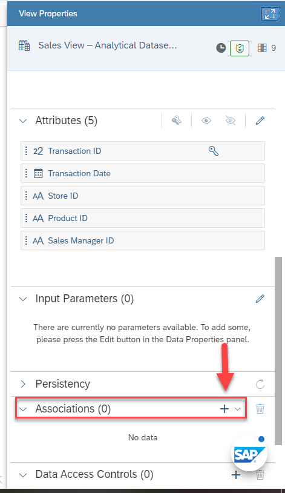
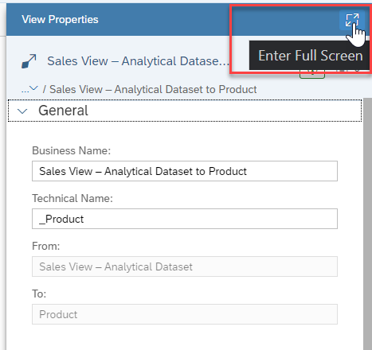
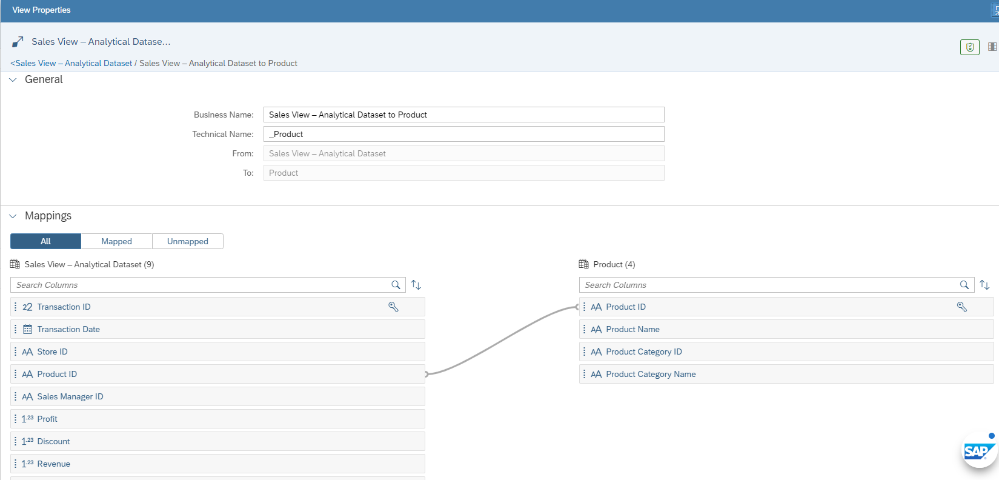
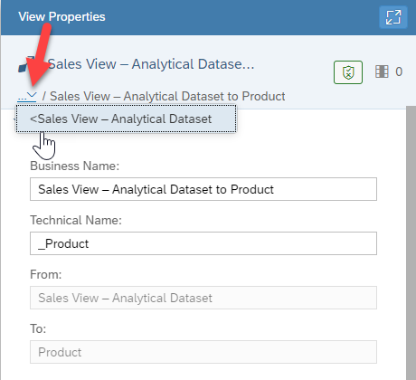

# Exercise 08 - Creating the View 

> :memo: **Note:** This is part of the <strong>Fast Track</strong> and a mandatory exercise.

---
## :beginner: Detour: SAP Data Warehouse Cloud - Views

A view in SAP Data Warehouse Cloud provides you with several benefits:
- Graphical or script-based editor
- Define views on top of remote, replicated data sources, or tables
- Define unions and joins, rename and remove columns, add calculations and filters
- Create Analytical Datasets, Dimensions or Relational Datasets
- Create Parent-Child or Level-based hierarchies in Dimension views
- Define measures & attributes in Analytical Datasets
- In the Graphical View Builder, you can compute and display the corresponding SQL Statement
   

A View in SAP Data Warehouse Cloud allows you to leverage local tables, remote tables, or views and combine
those into a new View. A View can also contain additional elements, such as filters and calculated columns and
a view is consumable in SAP Analytics Cloud.

## End of Detour

## Start of the exercise
In this exercise, we will create our first view based on our previously created tables into an asset in SAP Data Warehouse Cloud, which then can be consumed in SAP Analytics Cloud.

1. Log On to your SAP Data Warehouse Cloud tenant.
2. Select the menu option Data Builder on the left-hand side.
3. Click New Graphical View.
   
  
4. On the left-hand side you can decide between: <ul><li>Repository: Here you have access to the local tables (imported data), Views, Intelligent Lookups and Shared Objects.</li><li>Sources: Here you have access to tables and views from your connections.</li></ul>

5. Ensure you select the option Repository.
6. Open the list of Tables. 
7. You are presented with the list of tables, which we created previously.
   
  
8. Drag and Drop the table Sales Transactions to the canvas.
9. You automatically will – in addition to the table you dragged to the canvas – receive the output view as well,
in our example called View 1.
    
  
10. Ensure the option Details (top right corner) is enabled. Otherwise, click on the output view that was added, in our example View 1.
11. Navigate to the Properties window.
  

12. Here you can configure Properties for the final output: <ul><li>You can configure the Business Name as well as the Technical Name.</li><li>You can configure the Type of Dataset.</li><li>You can decide if the View can be consumed or not.</li><li>You can choose which of the available Columns are shown or will be hidden.</li><li>You can define additional Associations.</li><li>You can provide details on the Business Purpose, which then will be available as part of the
Business Catalog.</li></ul>
13. Enter ***Sales View – Analytical Dataset*** as Business Name.
14. The Technical Name will be generated based on the Business Name, but you can also change it and enter ***Sales_View__Analytical_Dataset***.
15. Set the semantic Usage to the ***Analytical Dataset*** option.
    
  
16. Enable the option Expose for Consumption.
    
  
17. In the panel on the right hand side, scroll down to the Attributes section.
18. Now open the context menu for the Attribute ***Profit***
19. Select the option Change to Measure.
   
  
20. Repeat the steps for the Attributes ***Discount***, ***Revenue***, and ***Cost***.
21. Now ensure you select the final output node called ***Sales View – Analytical Dataset***.
22. Navigate to the Details on the right-hand side.
23. Scroll down to the Associations.
24. Click the “+” sign to add a new Association.
  
  
25. Select the option Association.
26. You are being presented with the list of Tables and Views from your Space.
27. Select the entry for TABLE ***Product*** [Local Table (Dimension)].
28. Click ***OK***.
    
  
29. Click on the icon (top right corner) to expand the Details panel.
  

30. Ensure the Association is based on the column Product ID in both tables. In case the Association is not
suggested or is defined on another column, you can delete the join and use a simple drag and drop motion
to define a new one.
   

31. Click on the icon (top right corner) to collapse the Details panel.
32. In the Details panel now, click on the “More” option to navigate back to the main Properties window and
select the analytical Dataset option.
   

> :boom: ***Important*** :boom:   
> 33. You can now continue and repeat the steps 24 - 32 for the other associations: - TABLE: Sales Manager [Local Table (Dimension)] - VIEW: Dimension Store [View (Dimension)] – not the local table - VIEW: Time Dimension – Day [View (Dimension)] – not the local table

34. Ensure the Association for the Sales Manager table is based on the column ***Sales Manager ID*** in both tables. 
35. Ensure the Association for the Dimension Store View is based on the column ***Store ID*** in both tables. 
36. Ensure the Association for the time dimension is based on the columns ***Transaction Date*** and ***Date***.
 
37. In the Details panel now, click on the “More” option to navigate back to the main Properties window and
select the analytical Dataset option.
38. Save your View.
39. You will be asked to confirm the Business Name and Technical Name.
40. Click ***Save***.
41. Deploy your View.

## Summary

You have now created and deployed your first Analytical Dataset, which can now be consumed with SAP Analytics
Cloud.

Continue to - [Exercise 09: Business Layer - Dimension ](../ex09/README.md)
