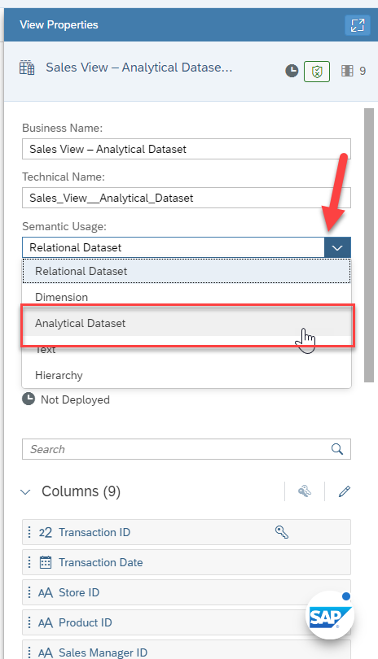

# Exercise 8 - Creating the View 

In this exercise, we will create our first view, combining the tables into an asset in SAP Data Warehouse Cloud, which then can be consumed in SAP Analytics Cloud.

A view in SAP Data Warehouse Cloud provides you with several benefits: <ul><li> Graphical or script-based editor</li><li>Define views on top of remote, replicated data sources, or tables</li><li>Define unions and joins, rename and remove columns, add calculations and filters</li><li>Create Analytical Datasets, Dimensions or Relational Datasets</li><li>Create Parent-Child or Level-based hierarchies in Dimension views</li><li>Define measures & attributes in Analytical Datasets</li><li>In the Graphical View Builder, you can compute and display the corresponding SQL Statement
   

A View in SAP Data Warehouse Cloud allows you to leverage local tables, remote tables, or views and combine
those into a new View. A View can also contain additional elements, such as filters and calculated columns and
a view is consumable in SAP Analytics Cloud.

In the next steps we will create the new View based on our previously created tables
1. Log On to your SAP Data Warehouse Cloud tenant.
2. Select the menu option Data Builder on the left-hand side.
  UPLOAD 

3. Click New Graphical View.
  UPLOAD 
  
4. On the left-hand side you can decide between: <ul><li>Repository: Here you have access to the local tables (imported data) and Views</li><li>Sources: Here you have access to your connections and the remote tables.
 

  
  
 
## Summary

You've now ...

Continue to - [Exercise 3 - Excercise 3 ](../ex3/README.md)
