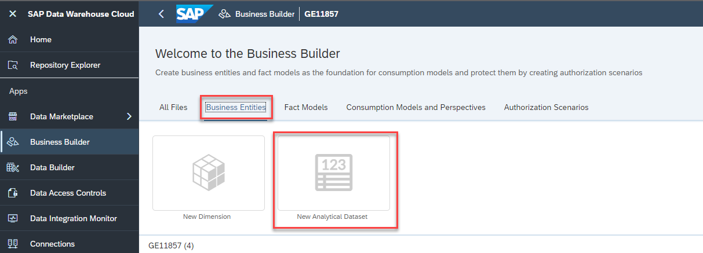
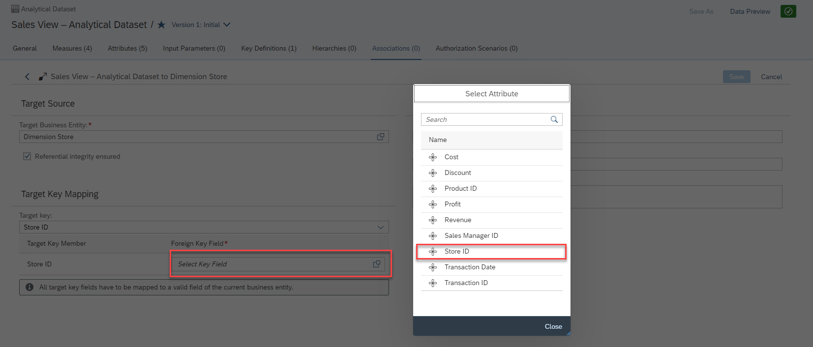

# Exercise 10 - Business Layer – Analytical Dataset 

:memo: **Note:** This is a <strong>MANDATORY</strong>  Exercise

In this exercise, we will now create the analytical data set as part of our Business Layer
and then associate the dimension with the data set.

1. Select the menu option Business Builder on the left-hand side.
2. In case you are being asked, select the Space you created previously.
3. Select the option Business Entities.
4. Select the option New Analytical Dataset
  

5. Select the entry Sales View - Analytical Dataset that we created previously.
6. For the Business Name enter - Sales View - Analytical Dataset (Business Layer)
7. The Technical Name will be suggested.
8. Click Create
  

9. When being asked, select the option “Yes, I want to copy the following properties of the data entity”
10. Ensure the options for Measures, Attributes, and Key Definitions are enabled.
11. Click Create.
  

12. Ensure the Business Name is set to Sales View - Analytical Dataset (Business Layer).
13. Ensure the option Allow public data access is enabled.
  

14. Navigate to the tab Measures.
15. You should see all previously configured measures based on the definition from our Analytical Dataset
  

16. Navigate to the tab Attributes.
17. You should see the complete list of Attributes we defined previously in the Analytical Dataset.
  

18. Navigate to the tab Key Definitions.
19. Click on the entry that is listed as Key Definition.
20. You should see the Transaction ID being listed as Key.
  

21. Navigate to the tab Associations.
22. Click the “+” sign in the top right to add a new Association.
  

23. Open the list of Target Business Entities
  

24. Select the entry Dimension Store.
25. Click Apply.
  

26. In the area Target Key Mapping, open the list of fields for the Foreign Key Field.
27. Select the column Store ID from your Analytical Dataset.
28. Click Save (top right).
  

29. Click the “+” sign to add another Association.
30. Open the list of Target Business Entities.
31. Select the entry Product.
32. Click Apply.
33. In the area Target Key Mapping, open the list of fields for the Foreign Key Field.
34. Select the column Product ID from your Analytical Dataset.
35. Click Save (top right).
36. Click the “+” sign to add another Association.
37. Open the list of Target Business Entities.
38. Select the entry Sales Manager.
39. Click Apply.
40. In the area Target Key Mapping, open the list of fields for the Foreign Key Field.
41. Select the column Sales Manager ID from your Analytical Dataset.
42. Click Save (top right).
43. Click the “+” sign to add another Association.
44. Open the list of Target Business Entities.
45. Select the entry Time Dimension – Day (Business Layer).
46. Click Apply.
47. In the area Target Key Mapping, open the list of fields for the Foreign Key Field.
48. Select the column Transaction Date from your Analytical Dataset.
49. Click Save (top right).
50. Navigate back to the tab General.
51. Set the Status to Ready to Use.
52. Click Save.
53. Select the Home menu.

## Summary

You've now ...FILL IN 

Continue to - [Business Layer – Consumption Layer ](../ex11/README.md)

