# Exercise 12 - Year over Year comparison

:memo: **Note:** This is a <strong>MANDATORY</strong>  Exercise

In this exercise, we will setup a story in SAP Analytics Cloud, which allows us to do a Year over Year comparison
of our revenue information

1. Log On to your SAP Analytics Cloud tenant.
  
 
:bulb: **Tip:** The system will ask you to resign in.

2. Select the menu Stories in the left-hand panel
3. Select "Classic Design Experience" when asked "What design mode would you like to use?"
 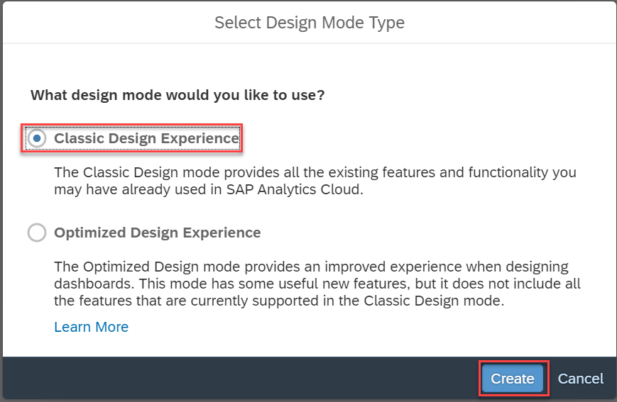 
 

4. Select the option Canvas to create a new Story.
  UPLOAD

5. You will be asked to select a Workspace.
6. Select the entry ANA161.??????
7. In the toolbar click on “Data” (top left) to add data from SAP Data Warehouse Cloud to your Story
8. Select the option Data From Data Source.
  

9. Open the list Connect to Live Data.
10. Select the entry SAP Data Warehouse Cloud.
  

11. You will be asked to select a Live Connection to SAP Data Warehouse Cloud
12. Please select the connection matching the SAP Data Warehouse Cloud system your selection. You can
choose from the following: <ul><li>DWCEU - for the SAP Data Warehouse System in Europe</li><li>DWCUS - for the SAP Data Warehouse System in US</li><li>DWCAPJ - for the SAP Data Warehouse System in APJ ????
 

13. When being asked to select a SPACE, select the Space your created previously – ANA161-XX. ????
14. Click OK. 
15. Afterwards you will be asked to select the Analytical Data Set or the Perspective from your Space.
16. For our first example, we will use the Analytical Data Set – Sales View – Analytical Dataset.
17. Click OK.
 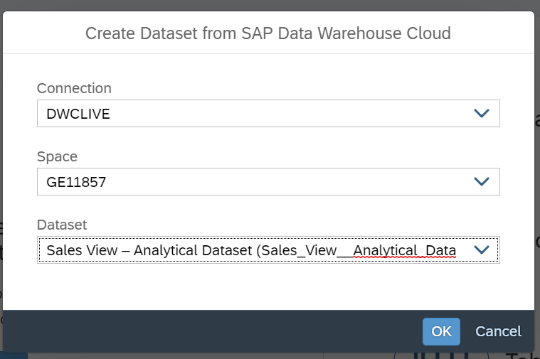 

18. Select the option to add a Chart.
19. Now select the newly created empty chart on the canvas.
20. Navigate to the Builder Panel on the right hand side.
 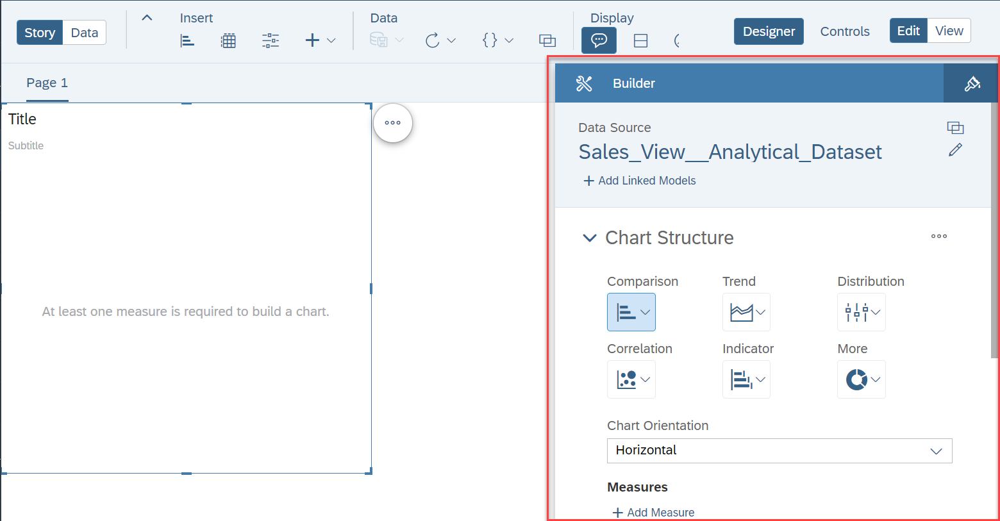 

21. Click Add Dimension as part of the Dimensions section.
 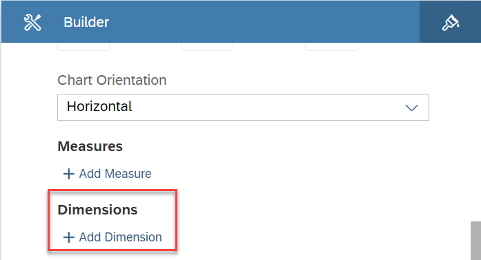 

22. Select Transaction Date.
 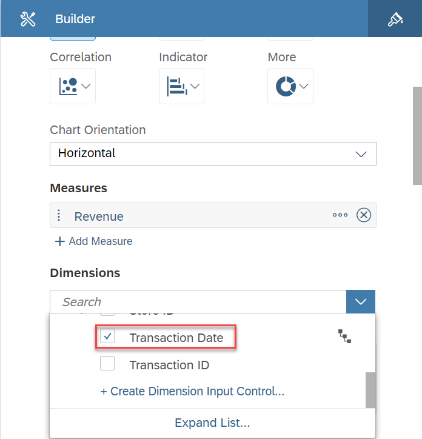 

23. Click Add Measure as part of the Measures section.
24. Select measure Revenue.
  

25. Now click on the hierarchy icon for dimension Transaction Date in the Builder Panel.
26. Select the option Set Hierarchy.
 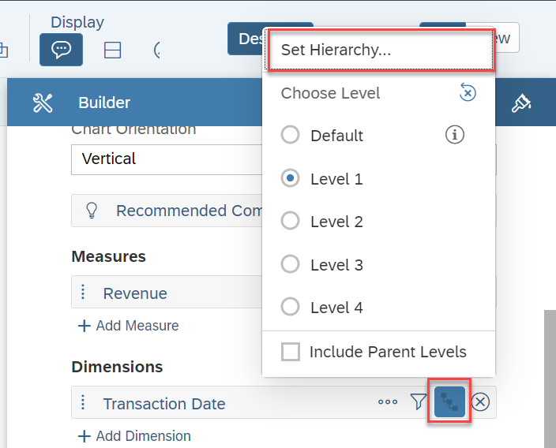 

27. Select the entry Year, Quarter, Month, Day.
28. Click Set.
  

29. Now click on the hierarchy icon for dimension Transaction Date in the Builder Panel a second time.
30. Select the option Level 4 – which represents the Month level.
 

31. Your chart should look similar to the image shown below.
 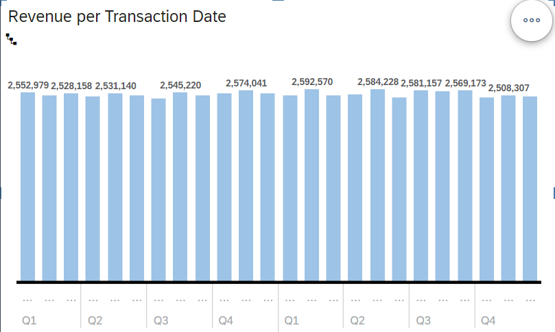 

32. So instead of looking at two years of data, we want to look at the current year – 2021 – and see the variance
compared to the last year data.
33. Click on the Filter icon for dimension Transaction Date.
34. Select the option Filter by Member.
 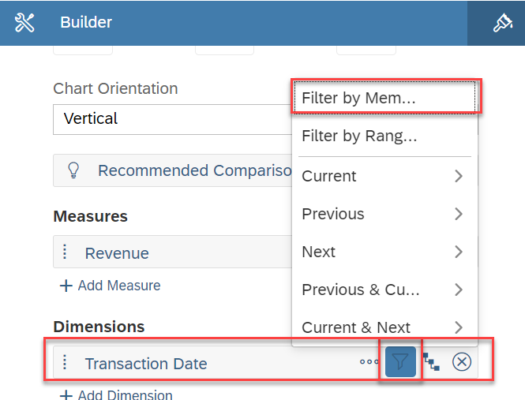 

35. Open the list of members and select the year 2021.
36. Click OK
 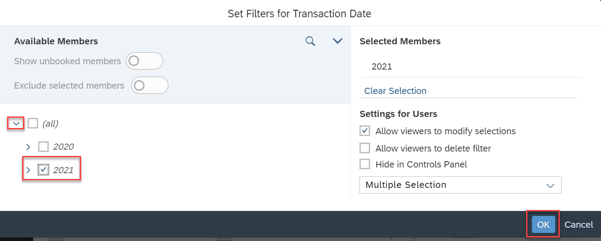 

37. Now click on the hierarchy icon for dimension Transaction Date in the Builder Panel.
38. Select the option Level 3 – which represents the Month level now as we selected a Year as entry point.
 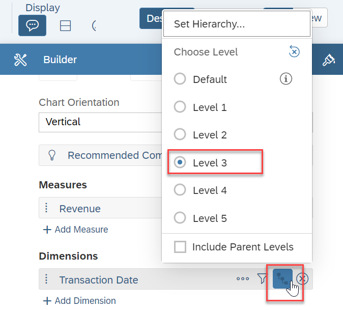 

39. Open the More menu for the chart (top right corner).
40. Select the menu Compare to
41. Select the option Previous Year.
 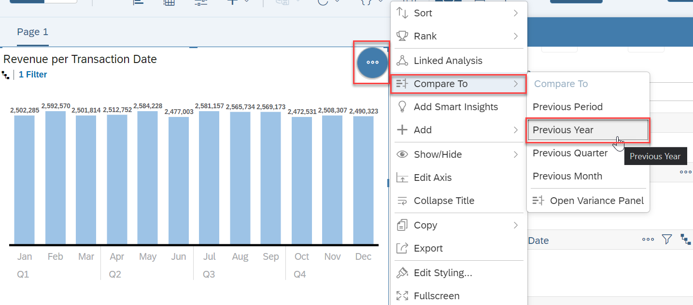 

42. Your chart should look like this.
  

43. In the File menu select the option "More" to save your story.
44. Select the User folder that matches your assigned user number.
45. Enter a Name and Description.
46. Click OK.

## Summary

You've now ...FILL IN

Continue to - [Revenue by Geography (requires Exercise 08 to be completed) ](../ex13/README.md)
