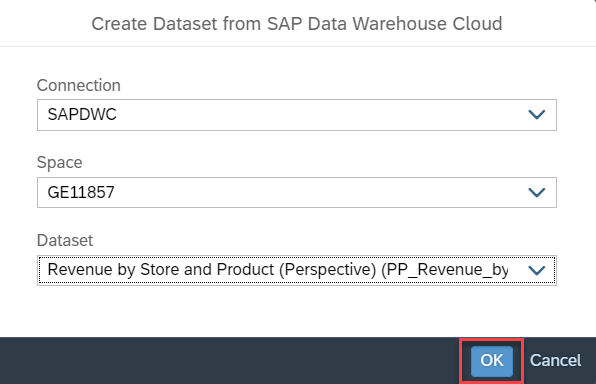
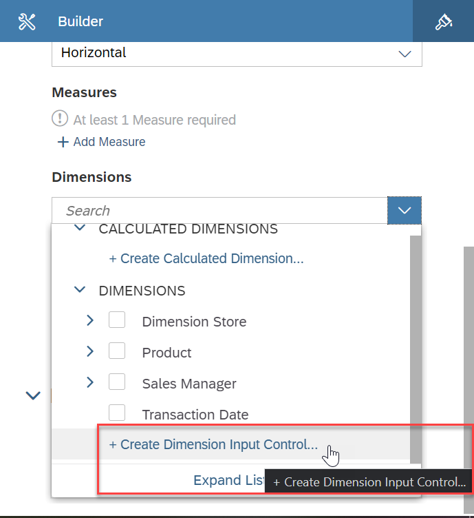
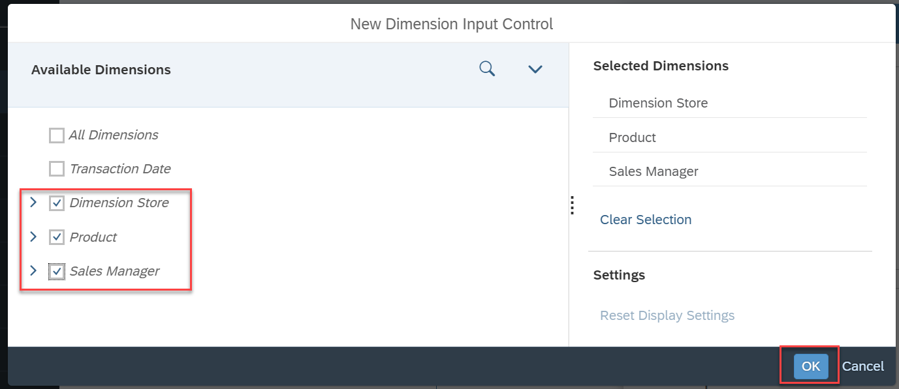
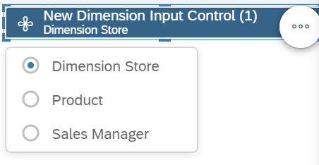
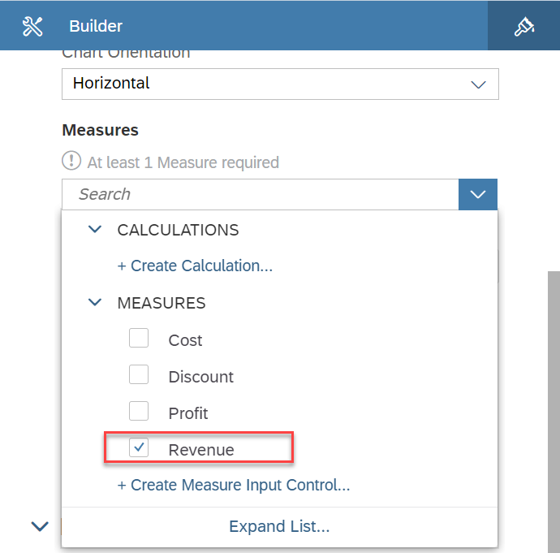
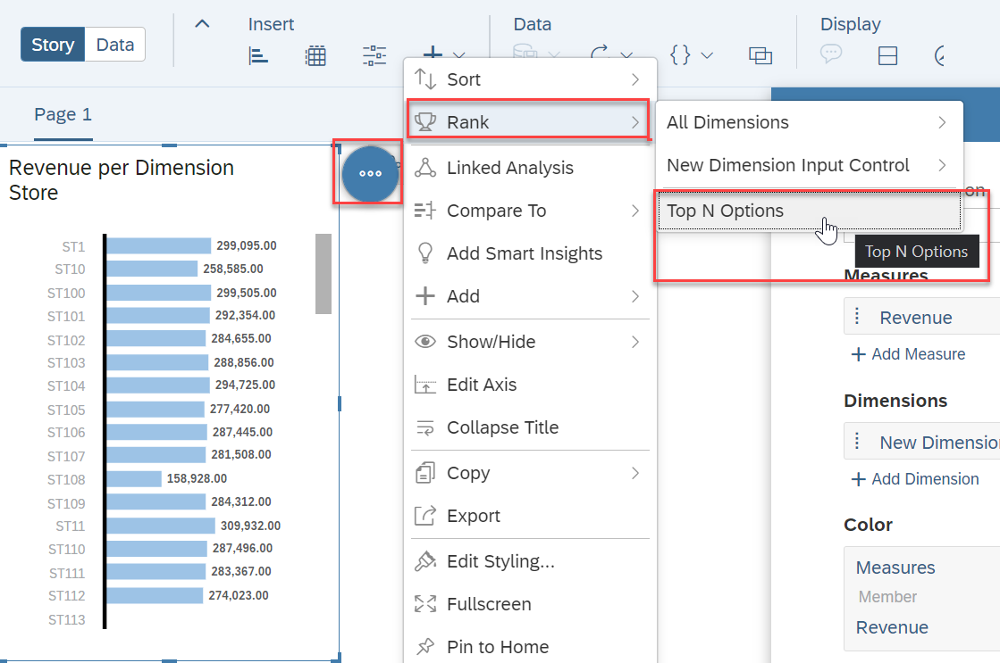

# Exercise 14 - Best Salesperson

>:memo: **Note:** This is part of the <strong>Fast Track</strong> and a mandatory exercise.

---

In this exercise, we will we will setup a story in SAP Analytics Cloud based on our Consumption Layer, and review who
our best salesperson is.

1. Log On to your SAP Analytics Cloud tenant.
  
 

---

>:bulb: **Tip:** The system will ask you to resign in.

---

2. Select the menu Stories in the left-hand panel
3. Select the option Canvas to create a new Story.
  
4. Select "Classic Design Experience" when asked "What design mode would you like to use?"
  

5. In the toolbar click on “Data” (top left) to add data from SAP Data Warehouse Cloud to your Story
6. Select the option Data From Data Source.
  

7. Open the list Connect to Live Data.
8. Select the entry SAP Data Warehouse Cloud.
  

9. You will be asked to select Connection to SAP Data Warehouse Cloud.
10. Please select "SAPDWC" as the connection 
 
 

11. When being asked to select your SPACE e.g. ***GE12345***.
12. Click OK. 

13. Afterwards you will be asked to select the Analytical Data Set or the Perspective from your Space.
14. For our third example, we will use the Perspective we created previously ***Revenue by Store and Product
(Perspective)***
15. Click OK.
  

16. Select the option to add a new Chart to the canvas.
  
  
17. Navigate to the Builder Panel on the right hand side.
    
  
18. Click the option Add Dimension as part of the Dimensions section.
  

19. Select the option Create Dimension Input Control.
  
  
20. Select the entries: <ul><li>Dimension Store</li><li>Product</li><li>Sales Manager
 
  
21. Click OK.
  
  
22. On your canvas you will then be presented with a token for the newly created Dimension Input Control.
  

23. Select the token and resize the token so that you can see all entries.
  
  
24. Now use a double click on the header of the Dimension Input Control and enter: Please select a dimension.
25. Select the empty chart.
26. Navigate to the Business Builder Panel on the right hand side.
27. Click the Add Measure option for the Measures section.
28. Select measure Revenue.
   
  
29. Now open the More Actions menu for the chart.  
30. Select the menu Rank.  
31. Select the option Top N Options.
  
  
32. Set the Value to 10.
33. Click Apply. 
  
  
34. You should now have a chart showing the Top 10 entries based on the dimension selected with the input
control and based on the Consumption Layer created in SAP Data Warehouse Cloud.
  
  
35. In the File menu select the option to save your story.
36. Select the User folder that matches your assigned user number.
37. Enter a Name and Description like ***Best Salesperson***.
38. Click OK.  

## Summary

:trophy: Congratulations you have now completed the exercises for this session! 

